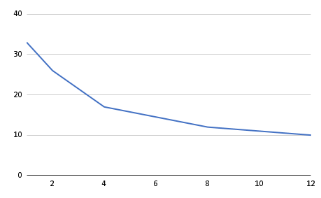
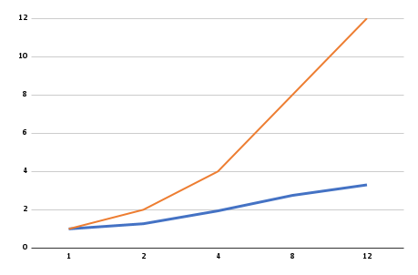
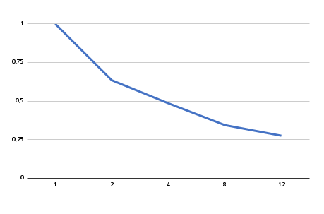

# Relatório da Relatório da atividade 5
**Disciplina: Programação Concorrente e Distribuída**
**Aluno(s): Naylanne Lissa Gomes Cunha**
**Turma: SIN04M1**
**Professor: Rafael Marconi Ramos**
**Data: 10/04/2026**

---

# 1. Descrição do Problema

Foi implementado um programa para avaliação/processamento de dados (arquivos) utilizando paralelismo com MPI, onde múltiplos processos trabalham simultaneamente para reduzir o tempo de execução.

## Orientações para preenchimento

Explique:

Foi utilizado um algoritmo de divisão de trabalho (data parallelism), onde:

Os dados são divididos entre os processos
Cada processo executa a mesma tarefa sobre uma parte dos dados. Os resultados são combinados ao final.

Esse modelo segue o padrão SPMD (Single Program Multiple Data).

Foram utilizados 5000 registros de um arquivo de 114MB, para atender o volume de dados suficiente para avaliar o desempenho da paralelização.

O objetivo foi reduzir o tempo de execução, melhorar o desempenho do processamento e avaliar o ganho de desempenho (speedup) e eficiência com múltiplos processos.

Foi utilizado um algoritmo baseado em divisão de dados (data parallelism), execução no modelo SPMD e comunicação entre processos utilizando MPI.

A complexidade do algoritmo é aproximadamente O(n) na versão sequencial e O(n/p) na versão paralela, onde n representa o tamanho dos dados e p o número de processos, considerando um cenário ideal.
---

# 2. Ambiente Experimental

Software: Visual Studio Code (VSCode) versão 1.112.0.

Linguagem: Python 3.14.2.

Modelo: Paralelismo de dados utilizando MPI (Message Passing Interface).

Hardware: Processador Intel Core i5-12500 com 6 núcleos e 16 GB de memória RAM.

Sistema Operacional: Windows 11.

| Item                        |   Descrição   |
| --------------------------- |   ---------   |
| Processador                 |    i5-12500   |
| Número de núcleos           |       6       |
| Memória RAM                 |      16gb     |
| Sistema Operacional         |   Windows 11  |
| Linguagem utilizada         |     Python    |
| Biblioteca de paralelização |      MPI      |
| Compilador / Versão         | VScode 1.112.0|

---

# 3. Metodologia de Testes

Os experimentos foram conduzidos com o objetivo de avaliar o desempenho do programa em diferentes níveis de paralelismo. O tempo de execução foi medido a partir do início até a finalização completa do processamento, considerando o tempo total gasto por cada execução do programa.

Para garantir maior confiabilidade nos resultados, foram realizadas múltiplas execuções para cada configuração de número de processos. A partir dessas execuções, foi calculada a média dos tempos obtidos, reduzindo o impacto de variações ocasionais no desempenho do sistema.

Os testes foram realizados utilizando uma entrada composta por 5000 registros, correspondentes a um arquivo de aproximadamente 114 MB, o que permitiu avaliar o comportamento do algoritmo diante de um volume significativo de dados.

Dessa forma, foi possível analisar o ganho de desempenho, o speedup e a eficiência do programa conforme o aumento do número de processos utilizados.

### Configurações testadas

Os experimentos devem ser realizados nas seguintes configurações:

* 1 thread/processo (versão serial)
* 2 threads/processos
* 4 threads/processos
* 8 threads/processos
* 12 threads/processos

### Procedimento experimental

Para cada configuração de número de processos, foram realizadas duas execuções, com o objetivo de reduzir possíveis variações nos tempos medidos. A média dos tempos foi calculada por meio da soma dos tempos obtidos em cada execução, dividida pelo número total de execuções realizadas.

Os experimentos foram conduzidos em condições controladas, sem a execução de outras atividades simultâneas na máquina, buscando minimizar interferências externas e garantir maior estabilidade e confiabilidade nos resultados obtidos.
---

# 4. Resultados Experimentais

Preencha a tabela com os **tempos médios de execução** obtidos.

## Orientações

* O tempo deve ser informado em **segundos**
* Utilizar a **média das execuções**

| Nº Threads/Processos | Tempo de Execução (s) |
| -------------------- | --------------------- |
| 1                    |          33           |
| 2                    |          26           |
| 4                    |          17           |
| 8                    |          12           |
| 12                   |          10           |

---

# 5. Cálculo de Speedup e Eficiência

## Fórmulas Utilizadas

### Speedup

```
Speedup(p) = T(1) / T(p)
```

Onde:

* **T(1)** = tempo da execução serial
* **T(p)** = tempo com p threads/processos

### Eficiência

```
Eficiência(p) = Speedup(p) / p
```

Onde:

* **p** = número de threads ou processos

---

# 6. Tabela de Resultados

Preencha a tabela abaixo utilizando os tempos medidos.

| Threads/Processos | Tempo (s) | Speedup | Eficiência |
| ----------------- | --------- | ------- | ---------- |
| 1                 |    33     |   1.0   |    100     |
| 2                 |    26     |   1.3   |    063     |
| 4                 |    17     |   1.9   |    049     |
| 8                 |    12     |   2.8   |    034     |
| 12                |    10     |   3.3   |    028     |

---

# 7. Gráfico de Tempo de Execução

Construa um gráfico mostrando o **tempo de execução em função do número de threads/processos**.

## Orientações

* Eixo X: número de threads/processos
* Eixo Y: tempo de execução (segundos)

Inserir o gráfico abaixo:



---

# 8. Gráfico de Speedup

Construa um gráfico mostrando o **speedup obtido**.

## Orientações

* Eixo X: número de threads/processos
* Eixo Y: speedup
* Incluir também a **linha de speedup ideal (linear)** para comparação

Inserir o gráfico abaixo:



---

# 9. Gráfico de Eficiência

Construa um gráfico mostrando a **eficiência da paralelização**.

## Orientações

* Eixo X: número de threads/processos
* Eixo Y: eficiência
* Valores entre 0 e 1

Inserir o gráfico abaixo:



---

# 10. Análise dos Resultados

Os resultados obtidos demonstram que o speedup alcançado não foi próximo do ideal, uma vez que, embora tenha havido melhora no desempenho com o aumento do número de processos, os valores ficaram significativamente abaixo do speedup teórico esperado. Por exemplo, com 12 processos, o speedup obtido foi de aproximadamente 3,3.

A aplicação apresentou escalabilidade parcial, pois o aumento do número de processos resultou em redução do tempo de execução. No entanto, esse ganho não foi proporcional ao número de processos, indicando limitações na eficiência do paralelismo.

A eficiência começou a cair a partir do aumento do número de processos, sendo mais perceptível a partir de 4 processos, e diminuindo progressivamente até 28% com 12 processos. Esse comportamento é esperado devido ao aumento do overhead de paralelização, evidenciado pela redução da eficiência com o aumento do número de processos. Esse overhead está relacionado principalmente à comunicação entre processos, sincronização e gerenciamento das tarefas.

Entre as possíveis causas para a perda de desempenho, destacam-se o custo de comunicação entre os processos, a sincronização necessária para coordenar a execução e a divisão desigual ou não totalmente eficiente da carga de trabalho. Além disso, podem existir gargalos no algoritmo, especialmente em trechos que não são paralelizáveis.

A comunicação entre processos utilizando MPI também contribui para o aumento do tempo total, especialmente quando o volume de dados é elevado. Adicionalmente, pode haver contenção de memória e cache, já que múltiplos processos competem pelos mesmos recursos de hardware, impactando negativamente o desempenho.

---

# 11. Conclusão

Com base nos resultados obtidos, conclui-se que o uso de paralelismo trouxe ganho de desempenho significativo em relação à execução sequencial, reduzindo o tempo total de processamento.

Embora o menor tempo de execução tenha sido obtido com 12 processos, o melhor equilíbrio entre desempenho e eficiência foi observado com 4 processos, que apresentou um speedup significativo aliado a uma eficiência ainda relativamente alta, sendo o melhor desempenho prático (custo x benefício). A partir desse ponto, o aumento no número de processos resultou em ganhos menores de desempenho e maior perda de eficiência, devido ao overhead de paralelização.

O programa apresentou escalabilidade, porém não de forma ideal, já que o aumento do número de processos não resultou em ganhos proporcionais de desempenho. A queda de eficiência evidencia a presença de overhead associado à paralelização.

Como melhorias sugere-se otimizar a divisão de tarefas entre os processos e reduzir a necessidade de comunicação e sincronização, a fim de maximizar a eficiência.

De forma geral, o experimento demonstrou na prática os benefícios e limitações do paralelismo, evidenciando que o aumento do número de processos nem sempre resulta em melhor desempenho, especialmente quando há custos adicionais envolvidos.

---
